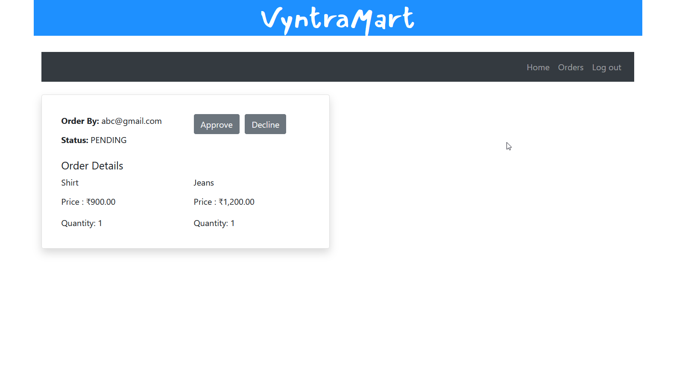

### VyntraMart - Online CLothing Mart

----------
### Contributors:
Utkarsh Mishra: https://github.com/ug-prog01
Sankalp Kulkarni: https://github.com/CapnSK
Niyati Bavishi: https://github.com/NiyatiBavishi

----------
### Introduction :

E-Commerce application developed for performing Admin and Customer user role operations with respective user interfaces. Application is implemented in two parts:
1. Backend: RESTfull web services: API's build using spring boot are used for handling all the back end operations which includes session management using encrypted JWT Tokens 
2. Front End: User interfaces designed and developed using Angular utilising web services for handling appropriate user actions.

----------
### Getting Started :

After cloning the repository,

Go to "Angular (Frontend)" folder and in CMD : >npm install 
In the same folder : >ng serve

Once the development server is running,
Go to "SpringBoot (Backend)" folder to the following path:
"/src/main/resources/"
Update the MySql user and password for database connection in this file  -> "application.properties"
And then in CMD : >mvn spring-boot:run

If both servers are running without any error:
Go to your browser and type: "http://localhost:4200/"

----------
### Features available based on the user role
* Admin
  * Adding products
  * Updating products
  * Deleting products
  * Manage Orders
* Customer
  * Registering into System
  * Login into Website
  * Updating Address
  * Adding product to Cart
  * Updating/ Deleting the Product
  * Placing the order

* Technologies: 
  * Angular 6
  * Typescript
  * Spring Boot
  * Hibernate with JPA 
  * MySQL
  * JWT Token (Session management)

----------
### Application Screenshots
* Login 
    
* Register 
    
* Customer
    * Address 
        
    * Cart 
        
* Admin
    * Add new product and Edit Product
        
    * View orders 
        
---------